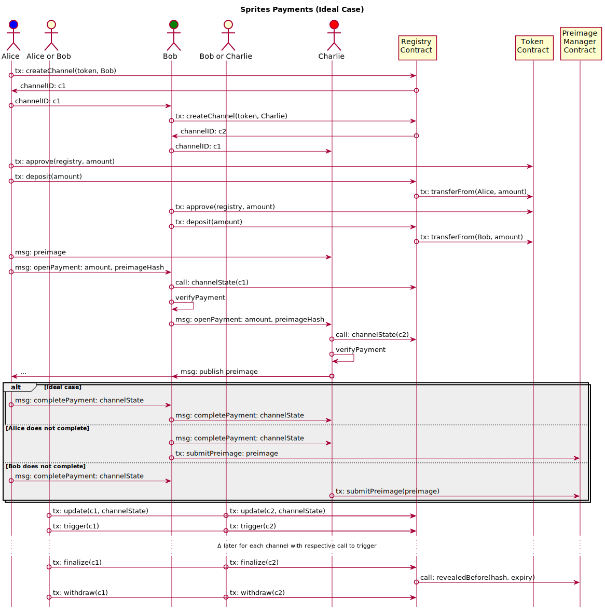

# Sprites

[](https://circleci.com/gh/enumatech/sprites-python)

- Public chat: https://riot.im/app/#/room/#sprites:matrix.org
- Sprites paper: https://arxiv.org/abs/1702.05812
- PISA: http://www0.cs.ucl.ac.uk/staff/P.McCorry/pisa.pdf

This project was based on a proof of concept implementation of the sprites
channels https://github.com/amiller/sprites.

### Development

- Install [nix](https://nixos.org/nix/download.html).
- Install `direnv` by running `nix-env -iA nixpkgs.direnv`.

Activate `direnv`, compile contracts and start a `geth` dev chain.
```bash
direnv allow     # sets up nix and pipenv
overmind start   # or just overmind s
```
Run the tests in another terminal
```
make test
```

#### Formatting
Just run
```
make format
```
or install a [black](https://github.com/ambv/black) add-on for your favorite editor.

#### Updating Dependencies

- For nix: `utils/update-nix`.
- For pipenv: `pipenv update --dev`.

#### Adding Dependencies

- For non-python dependencies edit `shell.nix`.
- For python dependencies use `pipenv`, e. g.

```
pipenv install my_dependency
```

### ChannelState

- credits
- withdrawals
- round
- preimageHash
- amount
- expiry
- direction of payment (new addition)

### Channel Opening and Payment



Note: this section is WIP, need to verify against paper and consider `credits` and `withdrawals`
as well as triggering the contract to set a deadline.

Assumptions:

- `N` parties (aka players) `A`, `B`, ... want to open channels for a payment.
- `x`: preimage, payment ID, secret
- `h=h(x)`: preimage hash, payment ID hash
- Assume `A` want so to send `$Q` to recipient `R`.

#### Normal (all is well) case
1. Sender `A`:
   - Call `ChannelContract.openChannel(B.address, token)` remember returned `channelID`.
   - Send `token`, `channelID` to `B`.
   - Deposit `$D >= $Q` into channel: send `$D` to `channelContractAddress` and reference `channelID`
     in message.
   - Create preimage (aka payment ID) `x`.
   - Send secret `x` to final recipient.
   - Open conditional payment to next party `B`:
     - Send `openPayment` message to `B` with `(channel_address, $Q, paymentIDHash, expiry)`.
2. For each relayer:
   - Repeat steps above (except generation of payment ID) for new channel between relayer and next party.
3. Final recipient `R`: upon receiving conditional payment: publish secret `x`.
4. All except `R`: Upon receiving `x` send `completePayment` message to next party (unconditional payment).

I think the relayers also need to verify that the channel has enough collateral by querying its state, but
I'm  a bit fuzzy about this right now.

#### Cancellation
Cancellation is necessary if `x` is not published within time.

- Cancel conditional payment (this is simply waiting for timeout).

#### Dispute case
Dispute is necessary if `x` was published before deadline but a sending party did not complete payment
by sending an unconditional payment (step 4 above).

- Call `PreimageManager.revealedBefore(h, timeout)` to check if preimage was submitted already.
  - If not transact `PreimageManager.submitPreimage(x)`
- Call `ChannelContract.trigger(channel_address)` to set `deadline` for updating.
- Query state of channel to check if it's up to date. (TODO: use funcion for this or just lookup values?)
  - If not transact `ChannelContract.updateState({{latest available evidence}})`
- Close channel: `ChannelContract.finalize(paymentID)`. TODO check if this is really the only way!

In the example code the `finalize` function is the one that calls the
preimage manager in case of dispute.

Where `{{latest_available_evidence}}` message consists of a message with

- `channelID`: `uint`
- `sig`: `uint[3]` signature of *other* party (AFAIK the proof that other party agreed to this state of things).
- `r`: `uint` round number (needs to be greater than for last channel update)
- `credits`: `uint[2]` credits in state channel
- `withdrawls`: `uint[2]` withdrawals from state channel
- `h` `bytes32` paymentID hash
- `expiry`: `uint` expiry of payment
- `amount`: `uint` amount of payment

#### Withdrawals
- Check if channel state up to date
  - If not transact `ChannelContract.updateState({{latest available evidence}})`
- Transact `ChannelContract.withdraw(channel_addres, $withdrawAmount)`

#### Closing Channel
- Check if channel state is up to date
  - If not transact `ChannelContract.updateState({{latest available evidence}})`
- Transact `ChannelContract.finalize(channel_addres)`

### Example for trades / atomic swapes
Buyer would like to trade with Seller and A, B, D are intermediaries who
help to facilitate the transaction because they happen to have channels open.

The sequence of events would be
```
1. Buyer: generate preimage x
2. Conditional Payment Buyer  -> A      of $P OAX
3. Conditional Payment A      -> B      of $P OAX
4. Conditional Payment B      -> Seller of $P OAX
5. Conditional Payment Seller -> D      of $Q WETH
6. Conditional Payment D      -> Buyer  of $Q WETH
7. Buyer: publish preimage x
```
After receiving x all the nice actors would send unconditional payments (and
if necessary dispute the incoming payment).
